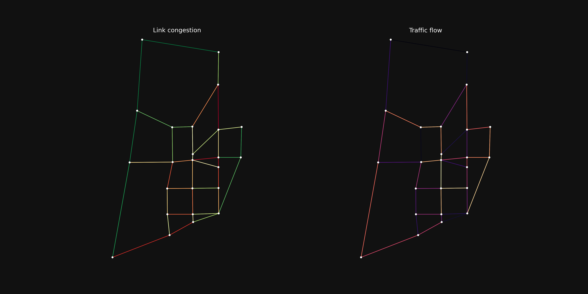

# Getting started

This walkthrough mirrors [`example.py`](https://github.com/ben-hudson/pytntp/blob/main/example.py),
which loads the SiouxFalls network, computes a congestion metric, and renders a
two-panel map.

## 1. Read the network files

A TNTP network is split across separate files. `tntp` reads each into a
[GeoDataFrame][geopandas] (or plain DataFrame for flows):

```python
import tntp
from urllib.parse import urljoin

name = "SiouxFalls"
root = "https://raw.githubusercontent.com/bstabler/TransportationNetworks/refs/heads/master/SiouxFalls/"

flow_df = tntp.read_flow_file(urljoin(root, f"{name}_flow.tntp")).rename(
    columns={"From": "init_node", "To": "term_node"}
)
node_df = tntp.read_node_file(
    urljoin(root, f"{name}_node.tntp"), index_col="Node", x_col="X", y_col="Y", crs="EPSG:4326"
)
net_df = tntp.read_net_file(urljoin(root, f"{name}_net.tntp"), crs="EPSG:4326").merge(
    flow_df, on=["init_node", "term_node"]
)
```

`read_net_file` parses the `<KEY> VALUE` metadata header (e.g. `FIRST THRU NODE`) and
attaches it to `net_df.attrs`. Flow attributes are merged onto the edges so they ride
along into the graph.

## 2. Convert to a NetworkX graph

[`convert_to_networkx`][tntp.convert.convert_to_networkx] routes through
`osmnx.convert.graph_from_gdfs`, so the result is osmnx-compatible: every node has
`x` / `y` attributes, edges are keyed `(u, v, 0)`, and the CRS travels on
`G.graph["crs"]`. Columns in `net_df` become edge attributes.

```python
network = tntp.convert_to_networkx(node_df, net_df)

for u, v, k, data in network.edges(keys=True, data=True):
    data["vc_ratio"] = data["Volume"] / data["capacity"]
```

## 3. Visualize

Drop the centroid connectors (`link_type == 3`) so they don't compress the colormap,
then color edges by percentile rank with
[`quantile_edge_colors`][tntp.vis.quantile_edge_colors]:

```python
import matplotlib.pyplot as plt
import osmnx as ox

road_edges = [(u, v, k) for u, v, k, d in network.edges(keys=True, data=True) if d.get("link_type") != 3]
roads = network.edge_subgraph(road_edges)

fig, (ax_vc, ax_flow) = plt.subplots(1, 2, figsize=(16, 8))
ox.plot.plot_graph(roads, ax=ax_vc, edge_color=tntp.quantile_edge_colors(roads, "vc_ratio", "RdYlGn_r"), show=False)
ox.plot.plot_graph(roads, ax=ax_flow, edge_color=tntp.quantile_edge_colors(roads, "Volume", "magma"), show=False)
```



[geopandas]: https://geopandas.org/
