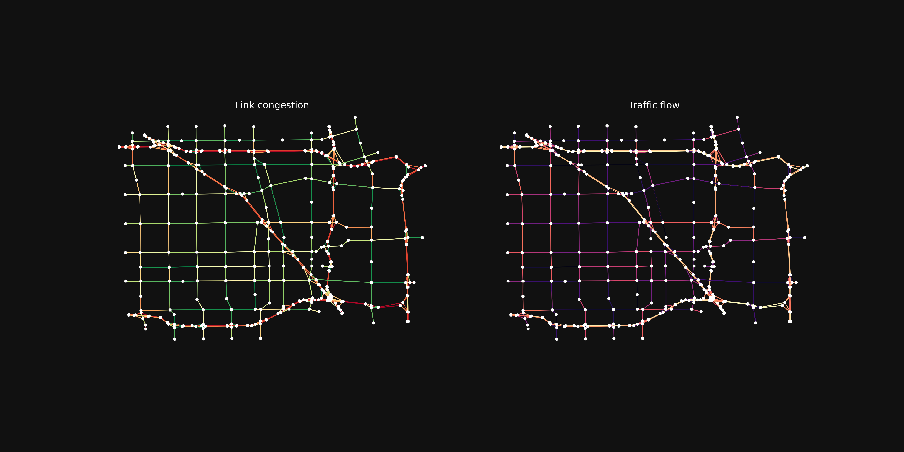

# Zone splitting

TNTP networks declare a `<FIRST THRU NODE>` value. Nodes with an id *below* it are
**centroids** (zones): they may originate or terminate trips, but traffic must never be
routed *through* them. [`split_zone_nodes`][tntp.transform.split_zone_nodes] enforces
this constraint structurally, and this page mirrors
[`example_split.py`](https://github.com/ben-hudson/pytntp/blob/main/example_split.py),
which demonstrates it on the Anaheim network.

## How it works

Each centroid `n` is split into two fresh integer ids allocated above the current
maximum node id:

- a **source** copy that keeps `n`'s outgoing edges and demand row, and
- a **sink** copy that keeps `n`'s incoming edges and demand column.

Because the source has no incoming edges and the sink has no outgoing edges, no path
can traverse the centroid. The original centroid ids are removed, and the returned
`node_df` gains a `parent_node` column recording each node's origin id (the centroid id
for both copies of a split zone, the node's own id otherwise).

## Loading and splitting

```python
import geopandas as gpd
import tntp
from urllib.parse import urljoin

root = "https://raw.githubusercontent.com/bstabler/TransportationNetworks/refs/heads/master/Anaheim/"
node_df = gpd.read_file(urljoin(root, "anaheim_nodes.geojson")).set_index("id").rename_axis("node")
net_df = tntp.read_net_file(urljoin(root, "Anaheim_net.tntp"), crs=node_df.crs)
demand_df = tntp.read_demand_file(urljoin(root, "Anaheim_trips.tntp"))
flow_df = tntp.read_flow_file(urljoin(root, "Anaheim_flow.tntp")).rename(
    columns={"From": "init_node", "To": "term_node"}
)

# Merge flow into net BEFORE splitting so Volume/Cost ride along through the centroid
# rename. pd.merge drops attrs, so preserve FIRST THRU NODE manually.
attrs = net_df.attrs
net_df = net_df.merge(flow_df, on=["init_node", "term_node"])
net_df.attrs = attrs

node_df, net_df, demand_df = tntp.split_zone_nodes(node_df, net_df, demand_df)
network = tntp.convert_to_networkx(node_df, net_df)
```

## Filtering with `parent_node`

After splitting, identify real roads structurally: an edge is a road iff *both*
endpoints descend from a through node (`parent_node >= FIRST THRU NODE`).

```python
first_thru_node = int(net_df.attrs["FIRST THRU NODE"])
through_nodes = set(node_df.index[node_df["parent_node"] >= first_thru_node])
road_edges = [(u, v, k) for u, v, k in network.edges(keys=True) if u in through_nodes and v in through_nodes]
roads = network.edge_subgraph(road_edges)
```


